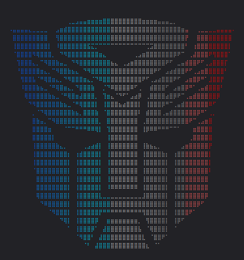

<p align="center">
  
</p>

# Optimus

A lightweight terminal interface for local Ollama models, written in Go.
Free and open source under the [MIT license](LICENSE). No account,
subscription, or payment is required.

Chat with local models through a streaming terminal UI, choose installed
models with `/models`, and save your preferred default with `/model default`.

## Install a release

Download prebuilt binaries from [GitHub Releases](https://github.com/ahmadmeselmani/optimus/releases).
Installers become available when the first release is published.

Linux and macOS:

```bash
curl -fsSL https://github.com/ahmadmeselmani/optimus/releases/latest/download/install.sh | sh
```

Windows PowerShell:

```powershell
irm https://github.com/ahmadmeselmani/optimus/releases/latest/download/install.ps1 | iex
```

Supported platforms: Linux, macOS, and Windows, each on x64 and ARM64.
Then launch from any directory:

```bash
optimus
```

Prebuilt releases need no Go toolchain. Install and start Ollama separately,
and pull a model such as `qwen2.5:3b`. Optimus connects to the local Ollama
server; models are not bundled. The Unix installer uses `/usr/local/bin`
and may ask for sudo. Windows installs for the current user and adds its
directory to PATH. Both installers verify the downloaded binary archive's
SHA-256 checksum. Run the same command again to update.

For manual installation, download the archive for your platform, verify it
against `checksums.txt`, and place the extracted binary in a directory on PATH.

## Start chatting

Install [Ollama](https://ollama.com/download) and start its local server if
it is not already running:

```bash
ollama serve
```

In another terminal:

```bash
ollama pull qwen2.5:3b
optimus
```

Type a message and press enter. Use `/models` to choose an installed model,
then `/model default` to remember your choice. Press esc to stop a response
and ctrl+c to quit.

## Default model

```bash
optimus config model qwen2.5:3b
optimus config model
```

Add `--project` when saving to set a default for the current directory.
Global settings live in `~/.optimus/config.yaml`; project settings live in
`.optimus/config.yaml` and take precedence.

## Commands

| Command | Purpose |
| --- | --- |
| `optimus` | Interactive chat |
| `optimus ask "Hi"` | One-off prompt without repository tools |
| `optimus config model [<name>] [--project]` | Show or save the default model |
| `optimus help` | CLI help |
| `optimus --version` | Show the installed version |
| `optimus "<repository question>"` | Existing read-only repository assistant |

The interactive TUI connects directly to the model. The separate repository
assistant remains available as implemented.

The project scope is local model connectivity and a polished, lightweight TUI.

## Build from source

Use the Go toolchain specified in `go.mod`:

```bash
git clone https://github.com/ahmadmeselmani/optimus.git
cd optimus
go build -o bin/ ./cmd/optimus
```

Run `./bin/optimus` on Linux/macOS or `.\bin\optimus.exe` on Windows.

## Manual releases

Commit the workflow to the repository's default branch (`master`) before
using GitHub's **Run workflow** button.

Releases are triggered manually. After committing the version to release,
create and push a tag:

```bash
git tag -a v0.1.0 -m "Optimus v0.1.0"
git push origin v0.1.0
```

On GitHub, open **Actions → Release → Run workflow** and enter `v0.1.0`.
The workflow builds that tag and creates a draft with platform archives,
installers, and checksums. Review the draft and publish it when ready.
Pushing a tag alone does not run the release workflow.

See [the handbook](handbook/docs/intro.md) for configuration and controls.
Run `make test` for Go tests and `make handbook-build` to validate the docs.

## Star History

[](https://star-history.com/#ahmadmeselmani/optimus&Date)
